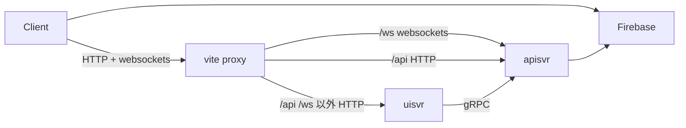

# sk-goa-chat

## Overview

sk-goa-chat は [SvelteKit](https://kit.svelte.dev/) と [Goa](https://goa.design/) を使ったWebアプリケーションの検証のためのプロジェクトです。

Goa は OpenAPI で定義された HTTP と protoc に基づいた gRPC による通信を同時にサポートするWebアプリケーションのフレームワークです。 
Goa は gRPC のようなストリーミングを HTTP においては WebSockets を用いて実現します。

SvelteKit は [Svelte](https://svelte.dev/) と [Vite](https://vitejs.dev/) を用いたWebアプリケーション開発のフレームワークです。

Vite は [SSR(Server Side Rendering)](https://ja.vitejs.dev/guide/ssr.html) の機能と [Proxy](https://ja.vitejs.dev/config/server-options.html#server-proxy) の機能を提供します。
つまりこのアプリケーションには２つのWebアプリケーションサーバーが存在します。


APIを提供する Goa のサーバーを `apisvr` と呼び、主にUIのアセットのホスティングとルーティングを行う SvelteKit + Viteのサーバーを `uisvr` と呼ぶことにします。
`uisvr` は Vite の Proxy の機能によって パスが `/api` と `/ws` にマッチするブラウザからのHTTPリクエストを `apisvr` に転送します。
また `uisvr` が SSRする際に必要なデータは、 gRPC を使って `apisvr` から取得します。

## Communication Paths



## Prerequisite

- [make](https://www.gnu.org/software/make/manual/make.html)
- [asdf](https://asdf-vm.com/) (あるいはasdf互換のバージョン管理ツール)
- [Docker Desktop](https://www.docker.com/ja-jp/products/docker-desktop/)
    - [Docker Compose](https://docs.docker.com/compose/) を主に使います


## Getting Started

### Install

```
make install
```

### Build

```
make build
```

### Run locally

```
make dev
```

### Open in browser

Open http://localhost:5173 

## How to develop

See [Development.md](./Development.md)

## Directories

Name                                    | Description
----------------------------------------|------------------
[backend/apisvr](./backend/apisvr/)             | APIを提供するサーバーのソースコード
[backend/applib](./backend/applib/)             | バックエンドのライブラリ的なパッケージ群
[backend/biz](./backend/biz/)                   | バックエンドのビジネスロジックのパッケージ群
[backend/containers](./backend/containers/)     | ローカルで使用する MySQL や Firebase Emulators のコンテナ
[backend/dbmigrations](./backend/dbmigrations/) | RDBのマイグレーション
[docs](./docs/)                         | ドキュメント
[frontend](./frontend/)                 | UIとそれを提供するサーバー(uisvr)のソースコード
[modifiers](./modifiers/)               | 自動生成されるコードに更に変更を加えるための ruby のスクリプト群
[tools][./tools]                        | 開発や運用で使用するツール群


## Libraries / Middlewares

- frontend
  - [SvelteKit](https://kit.svelte.dev/)
      - [Vite](https://vitejs.dev/)
  - [flowbite-svelte](https://flowbite-svelte.com/)
- backend
  - [Goa](https://goa.design/)
  - [sqlboiler](https://github.com/volatiletech/sqlboiler)
  - [goose](https://github.com/pressly/goose)
  - [zerolog](https://github.com/rs/zerolog)
  - [goahttpcheck](https://github.com/ikawaha/goahttpcheck)
- Middleware
  - [MySQL](https://www.mysql.com/)
  - [Firebase Authentication](https://firebase.google.com/docs/auth?hl=ja)
- E2E test
  - [Playwright](https://playwright.dev/)
- Tools
  - [Swagger UI](https://swagger.io/tools/swagger-ui/)

## やらないこと

- Webサービスとしてのリリースは行うつもりはありません
    - しかし実際のリリースに関する検証は行いたいので、一時的に何処かにリリースするかもしれません
- このリポジトリはコンセプトを検証するためのものであり、アプリケーションとして完成させることは主目的ではありませんので、不要と判断したバグ修正は行いません

## License

MIT
