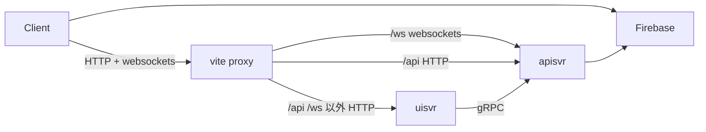

# sk-goa-chat

## 概要

sk-goa-chat は [SvelteKit](https://kit.svelte.dev/) と [Goa](https://goa.design/) を使ったWebアプリケーションの検証のためのプロジェクトです。

Goa は OpenAPI で定義された HTTP と protoc に基づいた gRPC による通信を同時にサポートするWebアプリケーションのフレームワークです。 Goa は gRPC のようなストリーミングを HTTP においては WebSockets を用いて実現します。

SvelteKit は [Svelte](https://svelte.dev/) と [Vite](https://vitejs.dev/) を用いたWebアプリケーション開発のフレームワークです。

Vite は [SSR(Server Side Rendering)](https://ja.vitejs.dev/guide/ssr.html) の機能と [Proxy](https://ja.vitejs.dev/config/server-options.html#server-proxy) の機能を提供します。
つまりこのアプリケーションには２つのWebアプリケーションサーバーが存在します。

APIを提供する Goa のサーバーを `apisvr` と呼び、主にUIのアセットのホスティングとルーティングを行う SvelteKit + Viteのサーバーを `uisvr` と呼ぶことにします。
`uisvr` は Vite の Proxy の機能によって パスが `/api` と `/ws` にマッチするブラウザからのHTTPリクエストを `apisvr` に転送します。
また `uisvr` が SSRする際に必要なデータは、 gRPC を使って `apisvr` から取得します。

## 通信経路

## 主なライブラリ等

- ui  で使用するライブラリ
  - [SvelteKit](https://kit.svelte.dev/)
      - [Vite](https://vitejs.dev/)
  - [flowbite-svelte](https://flowbite-svelte.com/)
- apisvr で使用するライブラリ
  - [Goa](https://goa.design/)
  - [sqlboiler](github.com/volatiletech/sqlboiler)
  - [goose](https://github.com/pressly/goose)
  - [zerolog](https://github.com/rs/zerolog)
  - [goahttpcheck](github.com/ikawaha/goahttpcheck)
- ミドルウェア
  - [MySQL](https://www.mysql.com/)
  - [Firebase Authentication](https://firebase.google.com/docs/auth?hl=ja)
- E2E テスト
  - [Playwright](https://playwright.dev/)

## やらないこと

- Webサービスとしてのリリースは行うつもりはありません
    - しかし実際のリリースに関する検証は行いたいので、一時的に何処かにリリースするかもしれません
- このリポジトリはコンセプトを検証するためのものであり、アプリケーションとして完成させることは主目的ではありませんので、不要と判断したバグ修正は行いません

## License

MIT
